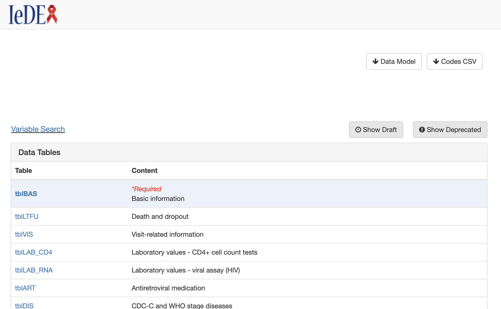
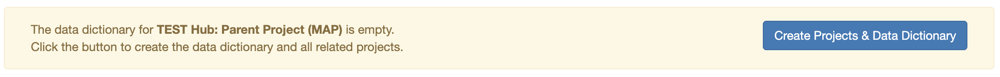

# Data Model Browser

A REDCap External Module that generates an auto-generated, web-browsable version of a Data Exchange Standard (DES) — a common data model for sharing data across projects and institutions.

## Description

The Data Model Browser creates an interactive, web-based interface for browsing and searching a common data model. It allows users to explore data tables, variables, code lists, and metadata through a wiki-style browser that can be shared publicly or restricted to specific REDCap users.

## Features

- **Interactive Data Model Browsing** — View all tables and variables in your data model through a navigable web interface.
- **Variable Search** — Search across all variables in the data model to quickly find what you need.
- **Variable Detail View** — Click into any variable to see its full metadata including description, data format, and code list references.
- **Downloadable PDF** — Auto-generated PDF documentation of your entire data model, regenerated automatically when changes are detected.
- **Downloadable CSV** — Export code lists as CSV files.
- **JSON Export** — Admin users can export the data model as JSON files.
- **Draft & Deprecated Indicators** — Toggle visibility of draft and deprecated variables.
- **Automated Change Detection** — Cron jobs run overnight to detect changes in the data model and automatically regenerate PDF and JSON documentation.
- **Email Notifications** — Optionally receive email alerts when changes are detected and new documentation is generated.
- **Flexible Privacy Settings** — Control who can access the browser:
    - **Public** — No login required; anyone with the link can view the page.
    - **This Project's users only** — Only users on the current REDCap project can view the page.
    - **Another Project's users** — Restrict access to users from a different REDCap project.

## Requirements

- **REDCap** >= 12.2.7
- **PHP** >= 8.2.25
- REDCap External Modules framework version 6

## Installation

1. Download and place the module folder in your REDCap `modules/` directory.
2. Enable the module at the system level via **Control Center > External Modules**.
3. Enable the module on the desired project.
4. Click on the install button on the module's configuration page to create the supporting projects and initialize the data model.

## Initial Setup

1. Navigate to the module's **External Module configuration** in your project.
2. Enter a **Project Name** for your data model.
3. Select a **Privacy Type** (Public, This Project's users, or Another Project's users).
4. Optionally add **User Permissions** — select REDCap users to automatically grant access to all Hub projects that power the browser.
5. Click the **Data Model Browser** link in the project menu. On first load, click on the Create Projects & Data Dictionary button. The module will create the required supporting REDCap projects:
    - **Settings** — Stores configuration, PDF, and JSON files.
    - **Data Model (0A)** — Stores table and variable definitions.
    - **Code Lists (0B)** — Stores code list / value set definitions.
    - **Toolkit Metadata (0C)** — Stores additional data model metadata.
    - **JSON Files** — Stores versioned JSON snapshots for change tracking.

## Configuration Options

| Setting | Description |
|---|---|
| **Project Name** | The name used to label the data model and generated projects. |
| **Privacy Type** | Controls access: Public, This Project's users, or Another Project's users. |
| **User Permissions** | REDCap users to be added to all supporting Hub projects with Project Design rights. |
| **Disable Crons** | Stops all automated cron jobs from running (no overnight JSON/PDF regeneration). |

## Automated Crons

| Cron | Frequency | Description |
|---|---|---|
| `createpdf` | Every 6 hours (runs between 12am–6am only) | Checks for data model changes and regenerates the PDF and JSON documentation if updates are found. |
| `regeneratepdf` | Every 60 seconds | Checks if the manual "Regenerate PDF" checkbox has been selected in the Settings project and regenerates on demand. |

## Authors

- **Eva Bascompte Moragas** — Vanderbilt University Medical Center (datacore@vumc.org)

## License

See the [LICENSE](LICENSE) file for details.